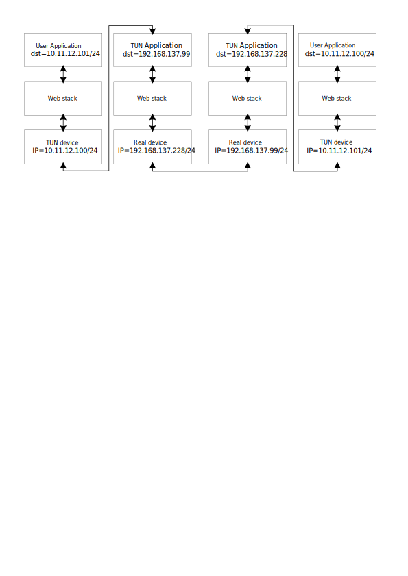

# 如何实现

用一个个人感觉比较直观的图来表示：（github暗色模式下箭头可能看的不清楚）

只看一个方向的：

发送端：用户程序向10.11.12.101发送报文，经过网络栈，来到了TUN设备（因为TUN设备的IP是10.11.12.100/24，所以内核默认会让目的地址网络是10.11.12.0/24的报文从TUN设备走），然后TUN程序从TUN设备中拿到了数据，对数据进行加密包装，再通过网络栈，从实际的网络端口发向192.168.137.99:50003，也就是对方的实际网络端口地址。

接收端：TUN程序监听任意地址的50003端口，接收到来自192.168.137.228的报文，到TUN程序解包解密，然后写到TUN设备。用户程序监听任意地址（因为是任意地址所以也可以是TUN设备的消息）的50002端口，接收到来自10.11.12.101的报文，到用户程序解包。
